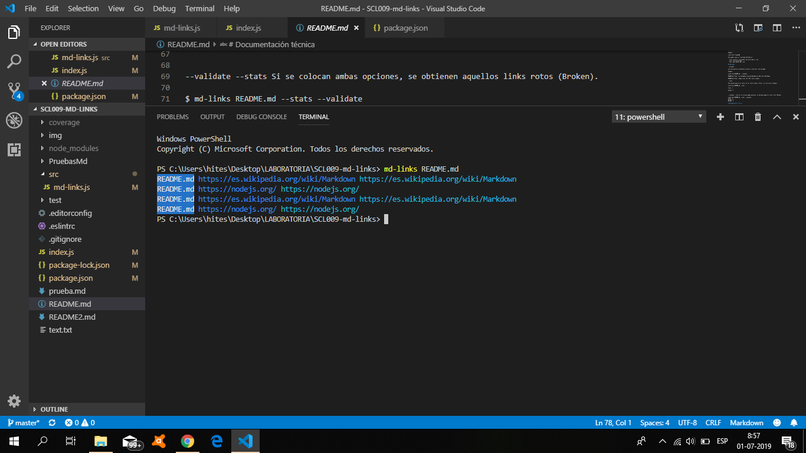
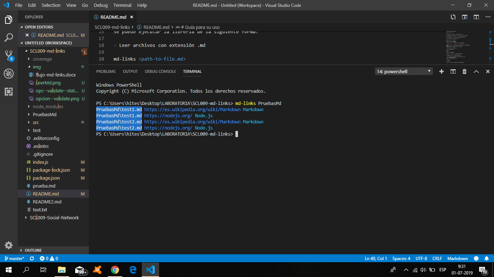
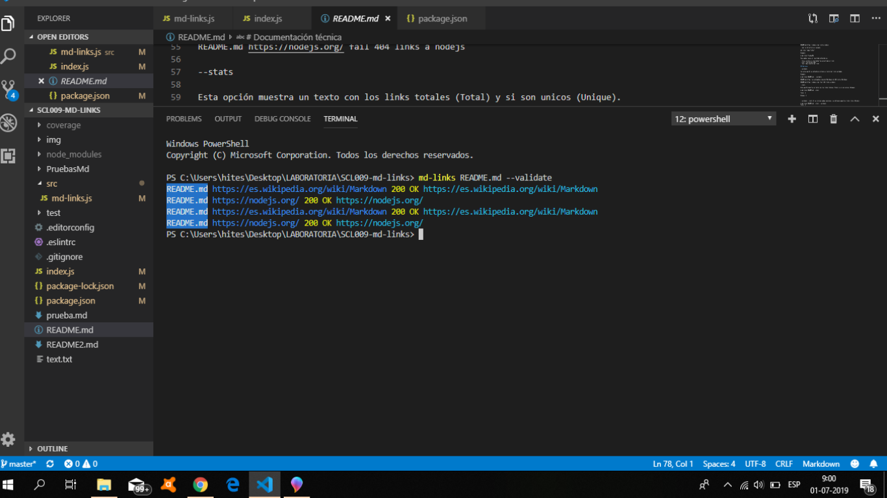
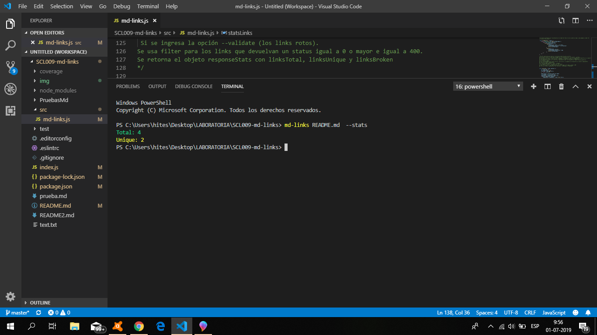
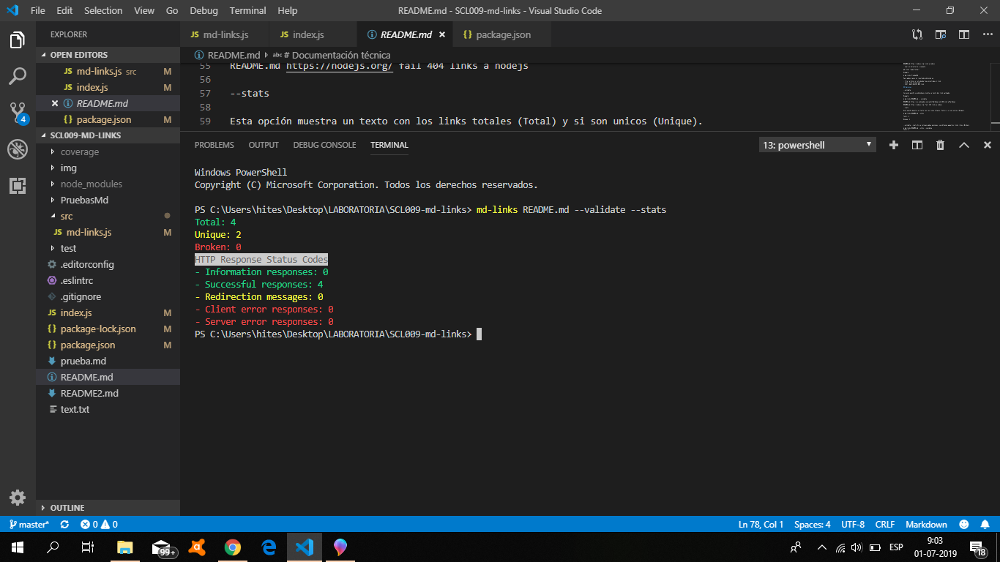

# betsi12-md-links

Es una libreria que extrae los links de archivos .md (markdown) y/o directorios, valida su status (ok, fail) y calcula estadisticas basicas sobre los links (totales, únicos y rotos).

# Instalación

npm install betsi12-md-links

# Guía para su uso

const md-links = require ( 'betsi12-md-links' );

CLI (Command Line Interface - Interfaz de Línea de Comando)

Se puede ejecutar la librería de la siguiente forma:

- Leer archivos con extensión .md

md-links <path-to-file.md>

Ejemplo: md-links README.md

- Leer carpetas o directorio

md-links "name folder"

Ejemplo:

$ md-links PruebasMd

Para ambos casos el resultado obtenido es:

- file: archivo o ruta donde fue encontrado el link.
- href: link encontrado.
- text: descripción del link.

## Opciones

--validate

Con esta opción se obtendran el status y texto del link validado.

Ejemplo: md-links README.md -- validate

--stats

Esta opción muestra un texto con los links totales (Total) y si son unicos (Unique).

Ejemplo: md-links README.md --stats

--validate --stats 

Si se colocan ambas opciones, se obtienen aquellos links rotos (Broken).

Ejemplo: md-links README.md --stats --validate

# Documentación técnica

# Autor

Betsi Salas

Laboratoria 2019